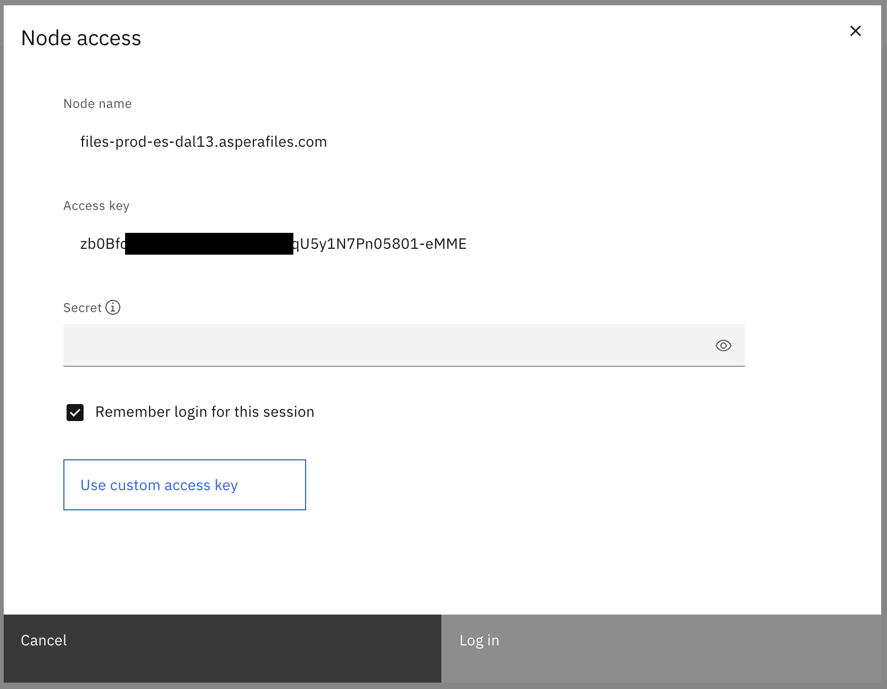
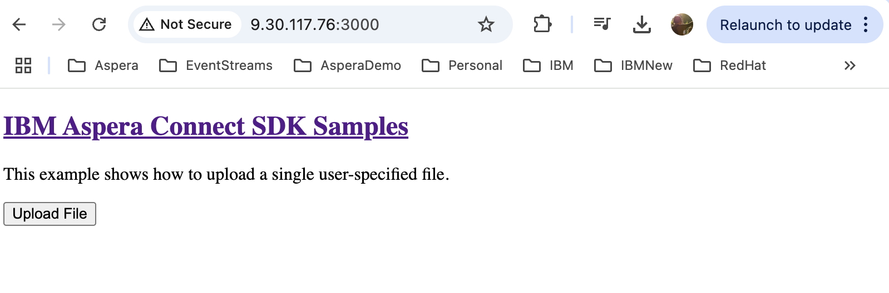
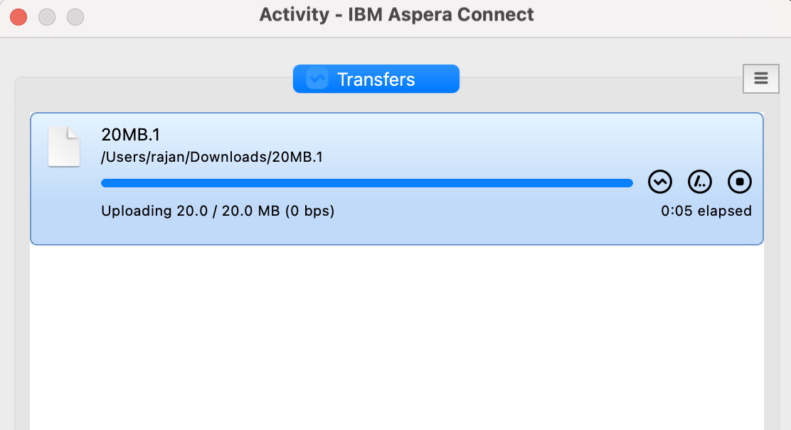
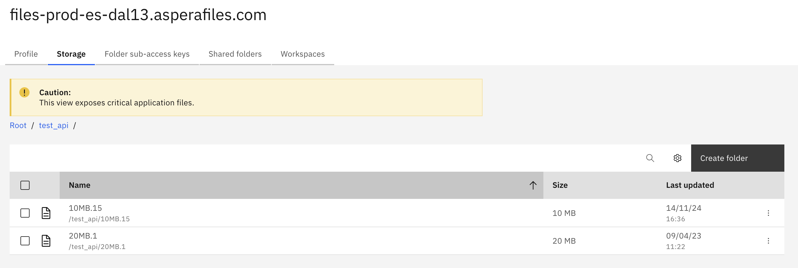

# Integrating Aspera On Cloud (AoC) with your Web Application
Aspera provides different types of API options to integrate with your web applications.   
There are already documents and references available that explain this in depth.   
The purpose of this document is to provide a simplified step-by-step guide for integrating Aspera On Cloud with your Web Application using Aspera Node API in javascript.    

## References
1. [https://github.com/laurent-martin/aspera-api-examples](https://github.com/laurent-martin/aspera-api-examples)   
2. [https://developer.ibm.com/apis/catalog/aspera--aspera-node-api/Introduction](https://developer.ibm.com/apis/catalog/aspera--aspera-node-api/Introduction)
3. [https://github.com/IBM/aspera-connect-sdk-js](https://github.com/IBM/aspera-connect-sdk-js)
4. [https://developer.ibm.com/apis/catalog/aspera--aspera-on-cloud-api/Introduction](https://developer.ibm.com/apis/catalog/aspera--aspera-on-cloud-api/Introduction)

## Setting Up the Development Environment
I will be showing javascript based example in this guide. So, it is needed to have a javascript development environment (e.g. nodejs). If you do not have one, you can get one setup quickly with these instruction. If you already have one - skip this section.    

    Install nodejs and npm
    yum install nodejs npm
    npm install -g serve   
    Check:  
    node --version
    npm --version

## Setting Up Aspera On Cloud (AoC)
We will create a folder and sub-access key in AoC. This folder will be used to store all files uploaded via the web application. We will also use basic token authentication in this guide. You can alternatively use Bearer Authentication which is a bit more complex than this.   
Refer to [4] for setting up Bearer Authentication.    
[Click here to learn about sub-access key](https://demo.ibmaspera.com/help/primary_and_sub-access_keys)

1. Login to AoC and open the Admin Application. [https://\<AoC URL>\/admin]   
2. Click on "Nodes and Storage" -> "Nodes".   
3. Click on the Node that you want to use to transfer files to. 
4. You will be asked to enter the secret to login to the node.  

        How to get the secret?   
        
        If you are using the default node created during service provisioning, then, the registered admin should have received an email with the secret.    
          
        If you are using on of nodes added by your admin, you may have to get the secret from the admin.

  

5. Once you enter the secret, Click on the storage tab and you will be able to browse through the storage.    
Create a new folder.
6. Go to the "Folder Sub-Access Keys" abd click on "Create New".    
Select the newly created folder and click Submit.   
Enter a name for the access keys and click Create.   
A new set of sub-access key and secret will be displayed. Take note / Download it for safe storage.   
You can now exit from the "create sub-access key" screen.   
7. Create a Basic Auth token from your access key and secret.   

        echo -n 'sub-access-key:secret' | base64

## Setup Aspera Connect SDK

1. Refer to [3] to install the Aspera Connect SDK. You can install from npm or using the source.  

        Example installing from Source.
        Create a local work folder.   
        mkdir /opt/software/myapp
        git clone https://github.com/IBM/aspera-connect-sdk-js.git

        Install / Run the sample app. 
        cd /opt/software/myapp/aspera-connect-sdk-js/
        npm install
        npm run build

2. Replace the index.html and index.js files in the examples/upload folder with the files in this github.   
[index.html](./index.html)   
[index.js](./index.js)   

3. At minimum, update the index.js file with the following details:  

        The URL of the Aspera Node
        The Basic Auth Token

4. Serve the new application. 

        cd /opt/software/myapp/aspera-connect-sdk-js/examples/upload
        serve -s
5. Open the web application and test upload. 

        Open http://<Local Web App URL>:3000
        Click on Upload and try transferring file. 

  

  

6. File should be uploaded to the folder created in AoC. 

  

